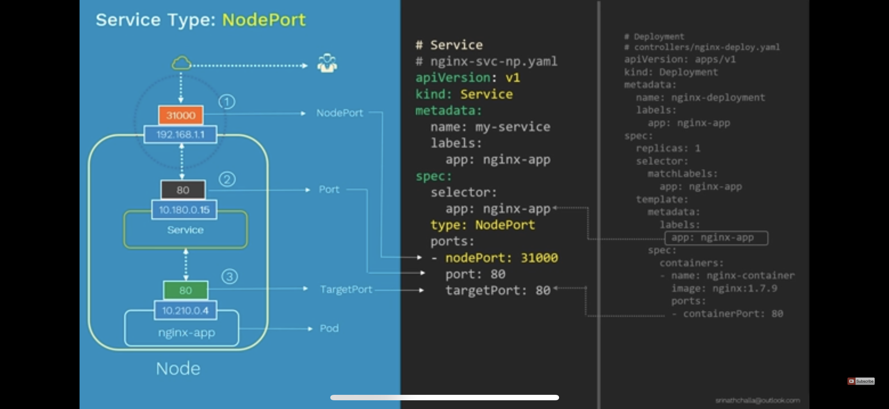

# Important notes

## Minicube

### Install minicube

> curl -LO [https://storage.googleapis.com/minikube/releases/latest/minikube-darwin-amd64](https://storage.googleapis.com/minikube/releases/latest/minikube-darwin-amd64)

> sudo install minikube-darwin-amd64 /usr/local/bin/minikube

### Operate minicube

* > minikube start OR minikube start --cpus 6 --memory 8192
  >
* > minikube stop
  >
* > minikube delete
  >
* > more /.kube/config
  >
* > export KUBECONFIG=/.kube/config
  >
* > minikube dashboard
  >
* > minikube ssh
  >
* > sudo vi /etc/systemd/network/[10-eth1.network](http://10-eth1.network) add DNS=8.8.8.8 under [Network]
  >
* > sudo vi /etc/systemd/network/[20-dhcp.network](http://20-dhcp.network) add DNS=8.8.8.8 under [Network]
  >
* > sudo systemctl restart systemd-networkd
  >

## Docker

### docker build image

> sudo docker build --tag gs7876-sample-api .

> docker tag gs7876-sample-api gs7876/sample-api:1.0.0

> docker push gs7876/sample-api:1.0.0

### docker run

> docker run -p 8080:9090 gs7876-sample-api

> 8080 is local port to access http://0.0.0.0:8080/health/full

> 9090 is comntainer port

| Flag value                        | Description                                                                                                                                     |
| --------------------------------- | ----------------------------------------------------------------------------------------------------------------------------------------------- |
| `-p 8080:80`                    | Map TCP port 80 in the container to port 8080 on the Docker host.                                                                               |
| `-p 192.168.1.100:8080:80`      | Map TCP port 80 in the container to port 8080 on the Docker host for connections to host IP 192.168.1.100.                                      |
| `-p 8080:80/udp`                | Map UDP port 80 in the container to port 8080 on the Docker host.                                                                               |
| `-p 8080:80/tcp -p 8080:80/udp` | Map TCP port 80 in the container to TCP port 8080 on the Docker host, and map UDP port 80 in the container to UDP port 8080 on the Docker host. |

## Kubernetes

https://kubernetes.io/docs/concepts/workloads/controllers/

### namespace

In Kubernetes, *namespaces* provides a mechanism for isolating groups of resources within a single cluster. Names of resources need to be unique within a namespace, but not across namespaces. Namespace-based scoping is applicable only for namespaced objects *(e.g. Deployments, Services, etc)* and not for cluster-wide objects  *(e.g. StorageClass, Nodes, PersistentVolumes, etc)* .

> kt create -f namespace.yaml

Setting the namespace preferenceYou can permanently save the namespace for all subsequent kubectl commands in that
context.

> gsingh5@intul18ad4f52b deployment % kubectl config set-context --current --namespace=gs7876
> Context "minikube" modified.
>
> gsingh5@intul18ad4f52b deployment % kubectl config view --minify | grep namespace:
> namespace: gs7876

### ReplicaSet

### Deployment

A *Deployment* provides declarative updates for Pods and ReplicaSets.

You describe a *desired state* in a Deployment, and the Deployment Controller changes the actual state to the desired state at a controlled rate. You can define Deployments to create new ReplicaSets, or to remove existing Deployments and adopt all their resources with new Deployments.

**Use Case**

The following are typical use cases for Deployments:

* [Create a Deployment to rollout a ReplicaSet](https://kubernetes.io/docs/concepts/workloads/controllers/deployment/#creating-a-deployment). The ReplicaSet creates Pods in the background. Check the status of the rollout to see if it succeeds or not.
* [Declare the new state of the Pods](https://kubernetes.io/docs/concepts/workloads/controllers/deployment/#updating-a-deployment)
  by updating the PodTemplateSpec of the Deployment. A new ReplicaSet is
  created and the Deployment manages moving the Pods from the old
  ReplicaSet to the new one at a controlled rate. Each new ReplicaSet
  updates the revision of the Deployment.
* [Rollback to an earlier Deployment revision](https://kubernetes.io/docs/concepts/workloads/controllers/deployment/#rolling-back-a-deployment) if the current state of the Deployment is not stable. Each rollback updates the revision of the Deployment.
* [Scale up the Deployment to facilitate more load](https://kubernetes.io/docs/concepts/workloads/controllers/deployment/#scaling-a-deployment).
* [Pause the rollout of a Deployment](https://kubernetes.io/docs/concepts/workloads/controllers/deployment/#pausing-and-resuming-a-deployment) to apply multiple fixes to its PodTemplateSpec and then resume it to start a new rollout.
* [Use the status of the Deployment](https://kubernetes.io/docs/concepts/workloads/controllers/deployment/#deployment-status) as an indicator that a rollout has stuck.
* [Clean up older ReplicaSets](https://kubernetes.io/docs/concepts/workloads/controllers/deployment/#clean-up-policy) that you don't need anymore.

### Service

#### NodePort



***Access app using target port internally (from inside the pod)***

```
gsingh5@intul18ad4f52b comprehension-insight % kt get pods -o wide
NAME                                           READY   STATUS    RESTARTS      AGE   IP           NODE       NOMINATED NODE   READINESS GATES
gs7876sample-app-deployment-645978f649-6kxrq   1/1     Running   1 (23m ago)   29h   172.17.0.2   minikube

curl http://172.17.0.2:9090/health/full   
```


***Access app using service port internally (from inside the pod)***

```
gsingh5@intul18ad4f52b comprehension-insight % kt get service -o wide
NAME                              TYPE       CLUSTER-IP       EXTERNAL-IP   PORT(S)          AGE    SELECTOR
gs7876-sample-service-node-port   NodePort   10.109.251.193

curl http://10.109.251.193:8080   
```

***Access app using External IP of node (Externally. incase of minikube tunneling required. in normal scenario you can use node external IP and nodePort to access the application.***

```
gsingh5@intul18ad4f52b comprehension-insight % minikube service gs7876-sample-service-node-port -n gs7876
|-----------|---------------------------------|-------------|---------------------------|
| NAMESPACE |              NAME               | TARGET PORT |            URL            |
|-----------|---------------------------------|-------------|---------------------------|
| gs7876    | gs7876-sample-service-node-port |        8080 | http://192.168.49.2:30007 |
|-----------|---------------------------------|-------------|---------------------------|
🏃  Starting tunnel for service gs7876-sample-service-node-port.
|-----------|---------------------------------|-------------|------------------------|
| NAMESPACE |              NAME               | TARGET PORT |          URL           |
|-----------|---------------------------------|-------------|------------------------|
| gs7876    | gs7876-sample-service-node-port |             | http://127.0.0.1:49181 |
|-----------|---------------------------------|-------------|------------------------|
🎉  Opening service gs7876/gs7876-sample-service-node-port in default browser...
❗  Because you are using a Docker driver on darwin, the terminal needs to be open to run it.

http://127.0.0.1:49181/health/full
```

Kubernetes Volume ManagementIngress

### ConfigMaps and Secrets
